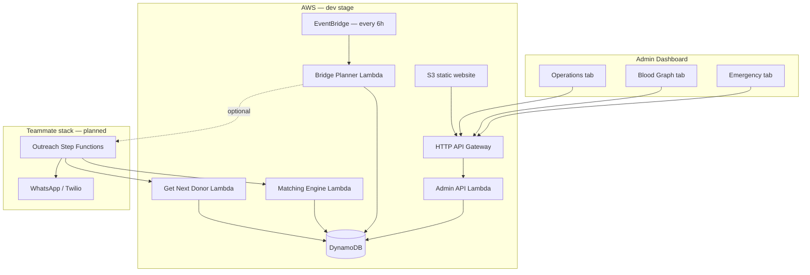

# Blood Warriors · Bridge Intelligence

An AI-powered intelligence layer for [Blood Warriors](https://www.bloodwarriors.in/home) — India's Thalassemia blood-support network. This project extends the existing Blood Warriors platform with **smart donor matching**, a **Blood Graph** view of the donor pool, **bridge health monitoring**, and **emergency ad-hoc matching** — so coordinators spend less time on manual WhatsApp coordination and more time on patients who need help now.

Built for the **AI for Good 2.0** hackathon as the data-science / matching half of the RaktSetu stack. The outreach layer (WhatsApp, Twilio, Step Functions mobilization) is owned by a teammate and consumes the Lambdas documented below.

---

## Table of contents

- [The current situation](#the-current-situation)
- [The problem we are solving](#the-problem-we-are-solving)
- [Our approach](#our-approach)
- [Architecture](#architecture)
- [Repository layout](#repository-layout)
- [Matching engine](#matching-engine)
- [Prerequisites](#prerequisites)
- [Local setup](#local-setup)
- [Local usage](#local-usage)
- [AWS deployment](#aws-deployment)
- [Admin API reference](#admin-api-reference)
- [Lambda integration (for outreach teammate)](#lambda-integration-for-outreach-teammate)
- [Environment variables](#environment-variables)
- [What's deployed vs. what's next](#whats-deployed-vs-whats-next)

---

## The current situation

[Blood Warriors](https://www.bloodwarriors.in/home) connects voluntary blood donors with **Thalassemia patients** — people who need **500–700 lifetime transfusions** and depend on a reliable donor community month after month.

Today, coordination is largely **manual**:

- Each patient is supported by a fixed **Blood Bridge** of roughly **8–10 committed donors** (6 active rotation + 4 buffer).
- Bridges are managed through **WhatsApp groups**, phone calls, and coordinator effort.
- When a donor drops out, declines, or is ineligible (90-day cooldown), someone has to manually find a replacement.
- **Emergency requests** outside the registry still rely on broadcast messages and luck.
- There is no unified view of **which bridges are under-strength**, which patients have **thin donor pools**, or which donors are most likely to **show up**.

Blood Warriors has rich donor and patient data (blood group, geography, donation history, eligibility). What is missing is an **autonomous intelligence layer** that turns that data into ranked, medically valid matches — and surfaces bridge health before a crisis.

---

## The problem we are solving

| Pain point | What breaks today | What Bridge Intelligence does |
|---|---|---|
| Manual bridge maintenance | Coordinators manually hunt replacements when slots go vacant | **Bridge Planner** drafts 10-donor bridges and backfills weak ones from the Blood Graph |
| Rigid 8–10 donor pools | A patient only "exists" inside their bridge; the wider compatible pool is invisible | **Blood Graph** connects every patient to all eligible compatible donors in Telangana |
| Emergency ad-hoc requests | No structured ranking for one-off patients | **Emergency matching** ranks the full pool and suggests **backfill replacements** when a top donor is already committed elsewhere |
| Donor reliability unknown | All donors treated equally in outreach | **Show-up rate** + **willingness model** rank donors who are closer, more reliable, and more likely to stay |
| No ops visibility | Health is in people's heads / chat threads | **Admin dashboard** shows unbridged patients, at-risk pools, bridge fill bars, and interactive graph views |

The goal is not to replace Blood Warriors — it is to give coordinators and the outreach bot a **single source of truth** for who to contact next, and why.

---

## Our approach

We treat matching as a **strict cascade of gates**, then a **weighted score**:

```
Compatibility (ABO/Rh)  →  90-day eligibility  →  patient availability  →  rank by score
```

Only pairs that pass all three gates receive a score. This guarantees every suggested donor is **medically valid and contactable right now**.

### Post-gate ranking (score in [0, 1])

| Signal | Weight | Meaning |
|---|---:|---|
| **Proximity** | 45% | Haversine distance between donor and patient (Telangana coordinates) |
| **Show-up rate** | 30% | Analytic probability the donor actually arrives when called |
| **Willingness** | 25% | ML retention score — donors likely to stay active in the ecosystem rank higher |

### Blood Bridge model

A bridge has **10 slots**: **6 active** (rotation) + **4 buffer** (standby). The **Bridge Planner** runs on a schedule, finds patients without bridges, and backfills bridges below target — persisting ranked fallback queues to DynamoDB so the outreach bot always has a "next best" donor.

### Willingness model (honest ML)

The dataset's `user_donation_active_status` label is partly rule-derived (inactive if no donation in a year). Training directly on those rule inputs gives meaningless perfect accuracy. We **exclude leakage features** and train a `GradientBoostingClassifier` on structural signals (role, donor type, cadence, geography). Willingness scores are **precomputed at seed time** and stored on each donor item in DynamoDB — Lambdas read the score at request time without loading scikit-learn.

### Blood Graph vs. rigid bridges

Instead of treating a bridge as the only pool, we build a **population-scale graph**: patients connect to every eligible compatible donor; donors connect by affinity. This lets us compute **coverage**, **at-risk flags**, **k-hop backup pools**, and fair allocation across patients — not just within one WhatsApp group.

---

## Architecture



### Runtime components

| Component | Handler | Role |
|---|---|---|
| **Admin API** | `lambdas.admin_api.handler` | FastAPI + Mangum; powers the React dashboard |
| **Matching Engine** | `lambdas.matching_engine.handler` | Returns ranked donor candidates for a patient (for Step Functions) |
| **Get Next Donor** | `lambdas.get_next_donor.handler` | Returns the single next-best donor when someone declines |
| **Bridge Planner** | `lambdas.bridge_planner.handler` | Scheduled bridge formation + backfill; writes to Bridges table |

### Data store (DynamoDB)

Tables follow the pattern `raktsetu-{resource}-{stage}`:

| Table | Contents |
|---|---|
| `raktsetu-donors-{stage}` | Donor profiles + precomputed `willingnessScore` |
| `raktsetu-patients-{stage}` | Patient profiles + transfusion cadence |
| `raktsetu-bridges-{stage}` | Bridge META, SLOT rows, ranked fallback queues |

The dev stage is seeded from `resources/Dataset.csv` (~4,442 donors, 84 patients, 79 bridges).

---

## Repository layout

```
ai_for_good_2/
├── admin/                  # React + Vite ops dashboard (Operations, Blood Graph, Emergency)
├── infra/                  # CloudFormation templates (plain + SAM reference)
├── lambdas/                # AWS Lambda handlers (admin API, matching, planner)
├── raktsetu/               # Core intelligence: matching, graph, bridge, ML, DynamoDB store
├── scripts/                # Pipeline, seed, deploy, local API runner
├── resources/              # Hackathon dataset + problem statement PDFs
├── requirements.txt        # Full local dev dependencies
├── requirements-lambda.txt # Slim deps for Lambda bundle (no sklearn/scipy at runtime)
└── .env.example            # AWS credentials template (copy to .env — never commit)
```

Key modules inside `raktsetu/`:

| Module | Responsibility |
|---|---|
| `compatibility.py` | ABO/Rh rules |
| `eligibility.py` | 90-day whole-blood cooldown |
| `availability.py` | Patient-specific availability gate |
| `scoring.py` | Proximity + show-up + willingness weights |
| `graph.py` | Candidate edges, Blood Graph, fair allocation, coverage |
| `bridge.py` | Bridge formation queue, ranked candidates, next-donor logic |
| `emergency.py` | Ad-hoc patient matching + backfill suggestions |
| `ml/willingness.py` | Donor retention model (local training / seed only) |
| `store.py` | DynamoDB read/write adapter |

---

## Matching engine

End-to-end flow for one patient:

1. **Load** donors and patients from DynamoDB (cached in Lambda for ~120 s).
2. **Annotate eligibility** — mark donors eligible or days-until-eligible.
3. **Build candidate edges** — every (patient, donor) pair passing compatibility, eligibility, and availability.
4. **Score** each edge with proximity, show-up, willingness.
5. **Rank** descending; return top N with slot hints (`active` vs `buffer`).

Emergency matching adds synthetic patient coordinates (by city), ranks the open pool, and if a top donor is already in someone else's bridge, proposes a **replacement backfill** for that bridge slot.

---

## Prerequisites

| Tool | Version | Purpose |
|---|---|---|
| Python | 3.10+ | Core pipeline and Lambdas |
| Node.js | 18+ | Admin dashboard |
| AWS CLI | v2 | Deploy and DynamoDB |
| zip | any | Lambda packaging |

Optional: `aws-sam-cli` (reference template in `infra/template.yaml`; deploy script uses plain CloudFormation because the SAM transform is blocked on some hackathon accounts).

---

## Local setup

### 1. Clone and create a virtual environment

```bash
git clone https://github.com/thusharashenoi/AI_For_Good2.0.git
cd AI_For_Good2.0
git checkout development/bridge-intelligence

python3 -m venv .venv
source .venv/bin/activate   # Windows: .venv\Scripts\activate
pip install -r requirements.txt
```

> Always use `.venv/bin/python` on this project so you hit the venv where dependencies are installed.

### 2. Configure AWS credentials

```bash
cp .env.example .env
# Edit .env with your IAM access key, secret, and region (us-east-1)
set -a; source .env; set +a
```

Never commit `.env`. It is listed in `.gitignore`.

### 3. Create DynamoDB tables and seed data

```bash
export STAGE=dev
.venv/bin/python -m scripts.create_tables
.venv/bin/python -m scripts.seed_dynamodb
```

Seeding trains the willingness model locally and writes ~4.4k donor items with scores. Expect a few minutes on first run.

### 4. Install admin dashboard dependencies

```bash
cd admin
npm install
cd ..
```

---

## Local usage

### Run the offline ML pipeline (CSV artifacts)

Produces Parquet/CSV outputs under `data/outputs/` for analysis and visualization:

```bash
.venv/bin/python -m scripts.run_pipeline
```

Outputs include `match_edges.parquet`, `coverage_report.csv`, `buffer_assignments.csv`, and `pipeline_stats.json`.

### Run the Admin API locally

```bash
export STAGE=dev
.venv/bin/python -m scripts.run_admin_api
```

- API docs: http://127.0.0.1:8000/docs  
- Health check: http://127.0.0.1:8000/healthz  

### Run the Admin dashboard locally

In a second terminal:

```bash
cd admin
npm run dev
```

Open http://127.0.0.1:5173 — Vite proxies `/api` → `http://127.0.0.1:8000` so there are no CORS issues.

### Dashboard tabs

| Tab | What you see |
|---|---|
| **Operations** | Unbridged patients, at-risk pools, bridge health bars; "View graph" for under-strength bridges |
| **Blood Graph** | Interactive vis-network graph of donors, patients, and bridge constellations |
| **Emergency** | Ad-hoc match form (name, blood group, city) → ranked donors with bridge/backfill column |

---

## AWS deployment

Deploy the full intelligence layer (Lambdas, API Gateway, S3 admin site, DynamoDB seed):

```bash
chmod +x scripts/deploy_intelligence.sh
./scripts/deploy_intelligence.sh
```

The script:

1. Ensures DynamoDB tables exist (`scripts/create_tables.py`)
2. Seeds donors, patients, and bridges (`scripts/seed_dynamodb.py`)
3. Builds a slim Lambda bundle (`requirements-lambda.txt`, ~126 MB)
4. Uploads the zip to S3 and deploys `infra/template-plain.yaml` via CloudFormation
5. Builds the admin UI with `VITE_API_BASE=<deployed API URL>` and syncs to the S3 website bucket

After deploy, note the stack outputs:

```bash
aws cloudformation describe-stacks \
  --stack-name raktsetu-intelligence-dev \
  --query 'Stacks[0].Outputs' --output table
```

Example outputs (your URLs will differ):

| Output | Example |
|---|---|
| `AdminApiUrl` | `https://<api-id>.execute-api.us-east-1.amazonaws.com/dev` |
| `AdminUiUrl` | `http://raktsetu-admin-ui-dev-<account-id>.s3-website-us-east-1.amazonaws.com` |
| `MatchingEngineArn` | ARN for teammate Step Functions |
| `GetNextDonorArn` | ARN for decline/retry loop |
| `BridgePlannerArn` | ARN for manual invoke / monitoring |

### Smoke tests

```bash
API=https://<your-api-id>.execute-api.us-east-1.amazonaws.com/dev

curl "$API/healthz"
curl "$API/stats"
curl "$API/unbridged"
curl -X POST "$API/emergency/match" \
  -H 'Content-Type: application/json' \
  -d '{"patient_name":"Test Patient","blood_group":"O+","city":"Hyderabad","limit":5}'
```

### Rebuild admin UI only (after API URL is known)

```bash
cd admin
VITE_API_BASE=https://<api-id>.execute-api.us-east-1.amazonaws.com/dev npm run build
aws s3 sync dist/ s3://raktsetu-admin-ui-dev-<account-id>/ --delete
```

---

## Admin API reference

Base path: `/` locally, `/<stage>/` on API Gateway (e.g. `/dev/stats`).

| Method | Path | Description |
|---|---|---|
| GET | `/healthz` | Liveness probe |
| GET | `/stats` | Headline counts (donors, patients, bridges, vacant slots) |
| GET | `/patients` | All patients with bridge status |
| GET | `/unbridged` | Patients with no bridge (planner targets) |
| GET | `/bridges` | Bridge health summary |
| GET | `/bridges/{id}` | Single bridge with slot detail |
| GET | `/at-risk` | Patients with thinnest eligible donor pools |
| GET | `/candidates/{patient_id}` | Ranked donor candidates for one patient |
| GET | `/graph/overview` | Blood Graph for unbridged / under-strength patients |
| GET | `/graph/bridge/{id}` | Bridge constellation view |
| GET | `/graph/patient/{id}` | Ranked pool for one patient |
| GET | `/emergency/cities` | Telangana cities for the emergency form |
| POST | `/emergency/match` | Ad-hoc emergency ranking |

Interactive docs when running locally: http://127.0.0.1:8000/docs

---

## Lambda integration (for outreach teammate)

Wire these ARNs into your **Outreach Step Functions** state machine:

### Matching Engine

**Input:**
```json
{
  "patientId": "<patient-id>",
  "excludeDonorIds": ["<already-contacted-or-confirmed>"],
  "limit": 20
}
```

**Output:**
```json
{
  "patientId": "...",
  "bloodGroup": "O+",
  "count": 12,
  "candidates": [
    {"donorId": "...", "score": 0.87, "group": "O+", "slotTypeHint": "active"}
  ]
}
```

### Get Next Donor

**Input:**
```json
{
  "patientId": "<patient-id>",
  "contactedDonorIds": ["<declined-or-pending>"],
  "excludeDonorIds": ["<confirmed-bridge-members>"]
}
```

**Output:** `{ "donorId": "...", "score": 0.81, "group": "O+" }` or `{ "donorId": null, "exhausted": true }`

### Bridge Planner

Triggered every **6 hours** by EventBridge. Optional manual invoke:

```json
{"dryRun": true, "maxPatients": 50, "mobilize": false}
```

Set `OUTREACH_STATE_MACHINE_ARN` on the planner Lambda and `PlannerMobilize=1` in CloudFormation when you are ready to auto-start outreach for vacant slots.

---

## Environment variables

| Variable | Default | Purpose |
|---|---|---|
| `STAGE` | `dev` | Table suffix and API Gateway stage |
| `AWS_ACCESS_KEY_ID` | — | AWS credentials (local / deploy) |
| `AWS_SECRET_ACCESS_KEY` | — | AWS credentials |
| `AWS_DEFAULT_REGION` | `us-east-1` | Region |
| `DYNAMODB_TABLE_DONORS` | `raktsetu-donors-{stage}` | Override donor table name |
| `DYNAMODB_TABLE_PATIENTS` | `raktsetu-patients-{stage}` | Override patient table name |
| `DYNAMODB_TABLE_BRIDGES` | `raktsetu-bridges-{stage}` | Override bridges table name |
| `CACHE_TTL` | `120` | Lambda in-memory frame cache (seconds) |
| `OUTREACH_STATE_MACHINE_ARN` | — | Bridge planner mobilization target |
| `VITE_API_BASE` | `/api` | Admin UI API base (set at build time for cloud) |

See `.env.example` for Bedrock model IDs (used by future conversational agent work, not required for matching).

---

## What's deployed vs. what's next

### Shipped in this branch

- DynamoDB-backed matching with willingness, show-up, and proximity scoring
- Four Lambdas + HTTP API + scheduled Bridge Planner
- React admin dashboard (Operations, Blood Graph, Emergency)
- CloudFormation deploy script and dev-stage seed data
- Emergency ad-hoc matching with bridge backfill suggestions

### Planned (Phase 3 — teammate / follow-up)

- WhatsApp / Twilio outreach integration via Step Functions
- `POST /mobilize/*` admin endpoints to trigger outreach from the dashboard
- Production (`prod`) stage aligned with teammate's SAM stack
- Bridge leaderboard and donor tier gamification

---

## Team

| Area | Owner |
|---|---|
| Matching, Blood Graph, bridge planner, admin dashboard | This repo (`development/bridge-intelligence`) |
| Donor onboarding, WhatsApp bot, Step Functions outreach | Teammate SAM stack |

Share the CloudFormation outputs (`MatchingEngineArn`, `GetNextDonorArn`) with your teammate so their state machine can call into this intelligence layer.

---

## Acknowledgments

Built for **AI for Good 2.0**, supporting [Blood Warriors](https://www.bloodwarriors.in/home) and Thalassemia patients across India. Dataset and problem statement are in `resources/`.
