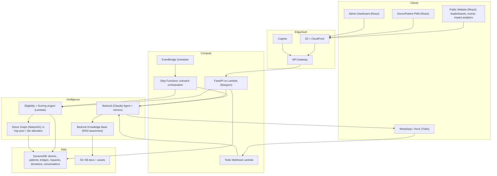
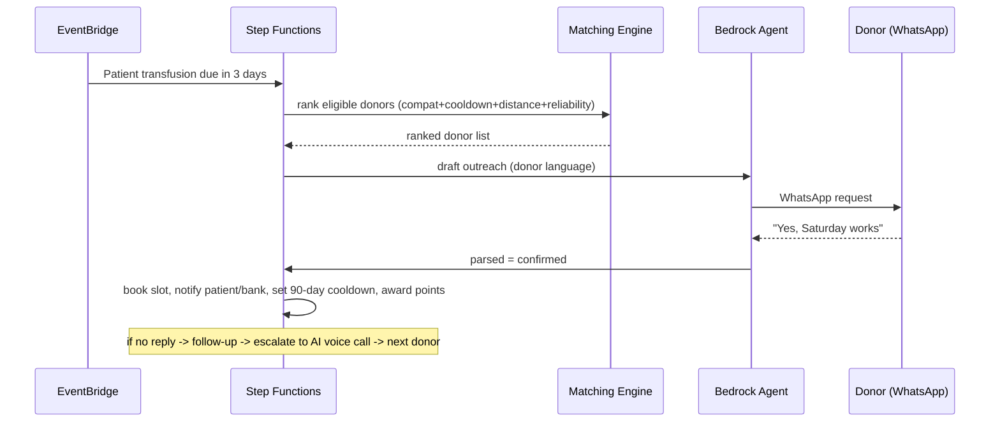

# RaktSetu - Autonomous AI Blood-Support Network (Blood Warriors)

## Goal
A live-on-AWS prototype that closes every gap in the brief: automation, fast/high-quality donor-patient mapping, telling donors exactly when they can donate again, getting patients transfusions on time, donor engagement, and thalassemia awareness/prevention. Built solo/full-stack in ~24h, so scope is split into a **deployable MVP core** and **stretch** items.

## Naming
"RaktSetu" (Rakt = blood, Setu = bridge) - mirrors Blood Warriors' "Blood Bridge" concept (a committed donor pool that keeps one patient supplied on a rotating schedule).

## Donor Graph Network (key differentiator)
Instead of a rigid Blood Bridge of ~8 donors hard-bound to one patient (fragile - a few dropouts/cooldowns collapse it), model the whole population as a **donor graph**. Each patient draws from their *reachable* eligible+available subgraph (primary bridge + 2nd/3rd-degree donors), so there's always a backup pool - a self-healing "Blood Bridge 2.0".
- **Nodes**: donors, patients, blood banks, organizations/colleges, events, locations.
- **Edges/criteria**: ABO/Rh compatibility, geo-proximity (pincode/geohash), shared org/college/workplace, referral ties, camp co-participation, past co-donation to same patient, reliability similarity.
- **Algorithms (hackathon, in-memory NetworkX)**: k-hop neighborhood expansion for the reachable pool; max-flow / `linear_sum_assignment` for *fair* donor->patient allocation (no donor over-tapped, bridges don't collapse); Louvain community detection to auto-form/optimize bridges; optional Node2Vec embeddings for "similar donor" / referral suggestions.
- **Coverage guarantee**: per-patient coverage score = expected eligible+available compatible donors over next N weeks given cooldowns; keep above threshold, alert/expand graph when at risk.
- **Production scale path (documented in pitch, not built in 24h)**: Amazon Neptune + Neptune ML running a GraphSAGE GNN (via DGL on SageMaker) for inductive donor->patient willingness link-prediction; offline-trained, scores cached in DynamoDB to avoid always-on endpoint cost.
- **Demo visual**: force-directed graph of the network on the public website/admin - strong Innovation signal.

## Hard constraints / decisions
- Channel: **Twilio WhatsApp API (already enabled on user's account)** + **Twilio Voice** for AI call escalation. Production-grade WhatsApp - no sandbox join-code caveat. Amazon Connect + Lex = stretch.
- Budget (~$40): all-serverless. **DynamoDB + Lambda + Bedrock (Claude)**. Avoid always-on SageMaker endpoints; matching = rules+scoring in Lambda, ML noted as offline/optional.
- Secrets (Twilio keys) in **Secrets Manager**.

## How it maps to the 6 problem goals
- Automation -> Step Functions orchestration + EventBridge Scheduler (no human in the loop for routine asks).
- Mapping speed/quality/effort -> donor graph gives each patient a large reachable pool (not just 8); eligibility + scoring engine ranks instantly; Bedrock explains the pick.
- "Donor doesn't know when to donate" -> per-donor cooldown clock (90-day whole-blood rule) + proactive "you're eligible again" nudge.
- "Patient not transfused on time" -> predictive next-transfusion date; donors arranged *before* the need.
- Engagement -> gamification (points, streaks, badges, Blood Bridge leaderboard) + conversational, multilingual agent with memory + **public leaderboards (national/state/gender/age/org) and event recognition**.
- Awareness/prevention -> Bedrock Knowledge Base (RAG) agent answers thalassemia questions + carrier-screening nudges + **public website with awareness content, donation-camp/community events, and live impact analytics**.

## Public website (the pitch layer)
A high-polish, public-facing React site (separate experience from the authenticated admin/PWA) that is the face of RaktSetu and a major Engagement + Awareness + "real implementation" win for judges:
- **Leaderboards** segmented across India: national, by state/city, by gender, by age band, by college/organization, and by Blood Bridge. Streaks, ranks, and "Warrior of the Month".
- **Community awareness events**: listing + map of upcoming donation camps and awareness drives, RSVP/registration, organizer sign-up, and post-event recognition (felicitation lists, shareable certificates/social cards).
- **Live impact analytics**: lives impacted, units donated, active Blood Bridges, average request fulfilment time, and a demand/supply heatmap across India - driven by real DynamoDB data, not static numbers.
- **AI/ML showcase**: surface the matching explanations, transfusion-demand forecasts, and donor-reliability insights so the intelligence is visible (reinforces the AI Component criterion).
- **Recognition**: badges, certificates, event felicitation, and shareable "I'm a Blood Warrior" cards to drive viral awareness.

## Architecture (AWS, serverless)

## Core demo flow (the "wow")

## Proposed repo structure
- `frontend/` - React + Vite + Tailwind: Public website (leaderboards/events/analytics) + Admin dashboard + Donor/Patient PWA
- `backend/` - FastAPI (Mangum) APIs: donors, patients, requests, matching, donations, eligibility, agent
- `agent/` - Bedrock prompts/tools, Twilio webhook handler, KB ingestion
- `matching/` - eligibility (cooldown + deferral rules) + donor scoring + donor graph (NetworkX: k-hop pools, fair allocation, community detection)
- `infra/` - AWS SAM (or CDK): Cognito, DynamoDB, API Gateway, Lambda, Step Functions, EventBridge, S3/CloudFront, Secrets Manager
- `data/` - seed donors/patients/blood-bridges/donation-history
- `.github/workflows/` - CI/CD (GitHub Actions -> SAM deploy)
- `README.md` - setup + demo script

## Key domain rules to encode
- Eligibility: whole-blood cooldown 90 days; age 18-65; weight >=45kg; Hb >=12.5; deferrals (recent fever/antibiotics, tattoo/piercing, pregnancy, recent vaccination, malaria-area travel, certain meds).
- Compatibility: ABO + Rh (extended Rh/Kell = stretch, valuable for thalassemia alloimmunization).
- Donor score = compatibility x eligibility x proximity (geohash) x reliability (historical response rate) x recency x predicted willingness.
- Patient model: pre-transfusion Hb target -> forecast next-transfusion date -> arrange donors ahead.
- Donor graph: reachable pool = k-hop eligible+available neighbors; allocation balances load across patients; coverage score must stay above threshold.

## MVP (must deploy) vs Stretch
- MVP: infra + data model + APIs + matching/eligibility engine + **donor graph (NetworkX) reachable pools + fair allocation + graph visual** + Bedrock WhatsApp agent + Step Functions outreach + cooldown/transfusion scheduler + admin dashboard + **public website (leaderboards + events + impact analytics)** + seed demo.
- Stretch: AI voice-call escalation (Twilio Voice / Amazon Connect+Lex), full gamification (certificates/social cards), RAG awareness chatbot, self-learning reliability feedback loop, multilingual (Hindi + 1 regional), **Amazon Neptune + Neptune ML GraphSAGE willingness model**, demand/supply heatmap.

## Risks
- Solo + 24h: protect the single end-to-end path first; everything else is additive. The public website is high-pitch-value but should reuse the same APIs/data to avoid extra build cost.
- Bedrock model/region access must be enabled early (do it in hour 1).
- Keep the public site reading from real DynamoDB aggregates (via cached API) so analytics/leaderboards are credible, not hardcoded.